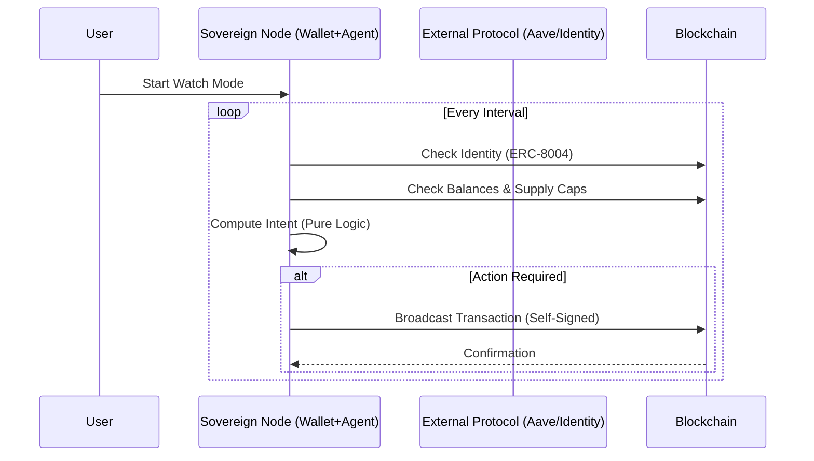

# Architecture

The application is structured into four distinct layers to ensure separation of concerns and testability.

## System Layers

1.  **Wallet Layer (`WalletService`)**:
    *   Wraps `@tetherto/wdk-wallet-evm`.
    *   Manages the seed phrase and derives the primary account.
    *   Exposes high-level methods for signing and sending transactions.

2.  **DeFi Layer (`AaveClient`)**:
    *   Handles protocol-specific logic (Aave V3).
    *   Manages ERC-20 approvals and Pool interactions (Supply/Withdraw).
    *   Uses `ethers.Interface` to encode calldata, delegating execution to the Wallet Layer.

3.  **Agent Layer (`AgentIntentEngine` / `AgentService`)**:
    *   **Engine**: A pure, side-effect-free function that takes current balances and returns an `AgentIntent` (Action + Amount + Reason).
    *   **Service**: Orchestrates data fetching from the DeFi layer and feeds it to the Engine.

4.  **CLI Layer (`runAgent.ts`)**:
    *   The entry point.
    *   Loads configuration.
    *   Displays state to the user.
    *   Prompts for confirmation before executing actions.

## Deployment Visions

### Current: Node.js (Sovereign Script)
The agent runs as a standard Node.js process. It is self-contained, relying only on an RPC provider. This is the standard deployment for developers and servers.

### Future: Pear Runtime (Unstoppable P2P Agent)
By packaging this agent as a P2P application on [Holepunch's Pear Runtime](https://pears.com), we can eliminate the "server" entirely. The agent becomes a truly unstoppable financial node, distributed peer-to-peer without DNS or cloud hosting.

## Data Flow

