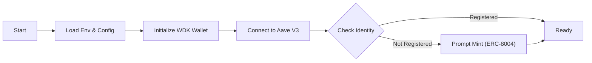
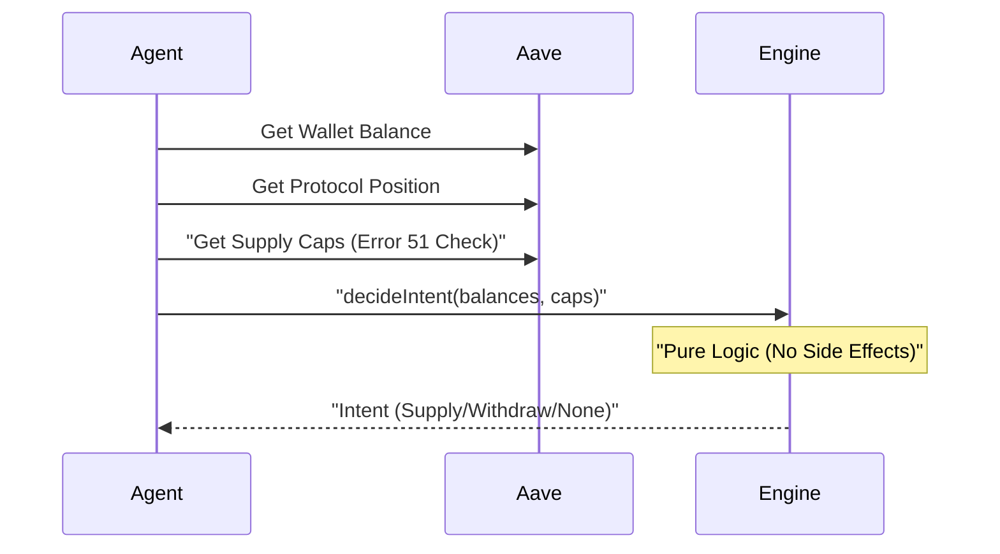
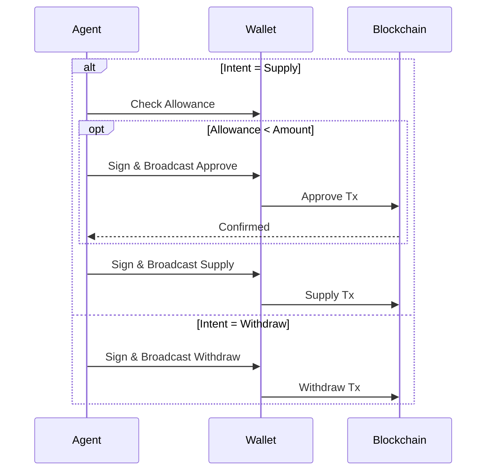

# System Flows: The Map

This document maps the lifecycle of the Sovereign Financial Node, from initialization to execution.

## 1. Initialization Flow
**Goal**: Establish a secure, identity-aware environment before any financial action.

**Why this flow?**
*   **WDK First**: We establish self-custody immediately.
*   **Identity Check**: We verify on-chain status (ERC-8004) to ensure the agent is a "citizen" of the protocol ecosystem.

## 2. Decision Flow (The "Brain")
**Goal**: Determine the optimal action without risking funds.

**Why this flow?**
*   **Off-Chain Intelligence**: We fetch data *first*, then reason about it offline. This saves gas and prevents failed transactions.
*   **Supply Cap Check**: We explicitly check Aave's supply caps to avoid "Error 51" reverts.

## 3. Execution Flow (The "Hands")
**Goal**: Execute the intent trustlessly.

**Why this flow?**
*   **Optimistic Approval**: We only approve if the allowance is insufficient, saving gas on subsequent runs.
*   **WDK Signing**: The private key never leaves the `WalletService` memory space.
